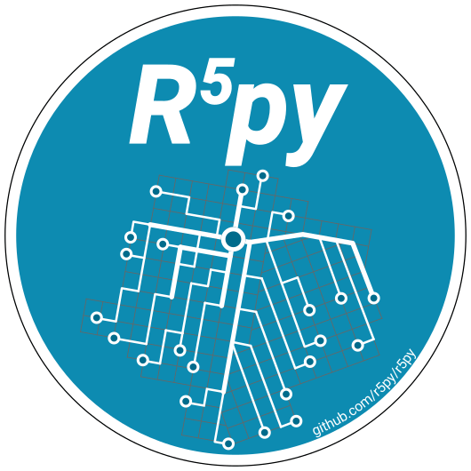

# r5py: Rapid Realistic Routing with R5 in Python 

[![Try r5py with binder](https://img.shields.io/badge/Try%20r5py%20with-binder-F5A252.svg?logo=data:image/png;base64,iVBORw0KGgoAAAANSUhEUgAAAFkAAABZCAMAAABi1XidAAAB8lBMVEX///9XmsrmZYH1olJXmsr1olJXmsrmZYH1olJXmsr1olJXmsrmZYH1olL1olJXmsr1olJXmsrmZYH1olL1olJXmsrmZYH1olJXmsr1olL1olJXmsrmZYH1olL1olJXmsrmZYH1olL1olL0nFf1olJXmsrmZYH1olJXmsq8dZb1olJXmsrmZYH1olJXmspXmspXmsr1olL1olJXmsrmZYH1olJXmsr1olL1olJXmsrmZYH1olL1olLeaIVXmsrmZYH1olL1olL1olJXmsrmZYH1olLna31Xmsr1olJXmsr1olJXmsrmZYH1olLqoVr1olJXmsr1olJXmsrmZYH1olL1olKkfaPobXvviGabgadXmsqThKuofKHmZ4Dobnr1olJXmsr1olJXmspXmsr1olJXmsrfZ4TuhWn1olL1olJXmsqBi7X1olJXmspZmslbmMhbmsdemsVfl8ZgmsNim8Jpk8F0m7R4m7F5nLB6jbh7jbiDirOEibOGnKaMhq+PnaCVg6qWg6qegKaff6WhnpKofKGtnomxeZy3noG6dZi+n3vCcpPDcpPGn3bLb4/Mb47UbIrVa4rYoGjdaIbeaIXhoWHmZYHobXvpcHjqdHXreHLroVrsfG/uhGnuh2bwj2Hxk17yl1vzmljzm1j0nlX1olL3AJXWAAAAbXRSTlMAEBAQHx8gICAuLjAwMDw9PUBAQEpQUFBXV1hgYGBkcHBwcXl8gICAgoiIkJCQlJicnJ2goKCmqK+wsLC4usDAwMjP0NDQ1NbW3Nzg4ODi5+3v8PDw8/T09PX29vb39/f5+fr7+/z8/Pz9/v7+zczCxgAABC5JREFUeAHN1ul3k0UUBvCb1CTVpmpaitAGSLSpSuKCLWpbTKNJFGlcSMAFF63iUmRccNG6gLbuxkXU66JAUef/9LSpmXnyLr3T5AO/rzl5zj137p136BISy44fKJXuGN/d19PUfYeO67Znqtf2KH33Id1psXoFdW30sPZ1sMvs2D060AHqws4FHeJojLZqnw53cmfvg+XR8mC0OEjuxrXEkX5ydeVJLVIlV0e10PXk5k7dYeHu7Cj1j+49uKg7uLU61tGLw1lq27ugQYlclHC4bgv7VQ+TAyj5Zc/UjsPvs1sd5cWryWObtvWT2EPa4rtnWW3JkpjggEpbOsPr7F7EyNewtpBIslA7p43HCsnwooXTEc3UmPmCNn5lrqTJxy6nRmcavGZVt/3Da2pD5NHvsOHJCrdc1G2r3DITpU7yic7w/7Rxnjc0kt5GC4djiv2Sz3Fb2iEZg41/ddsFDoyuYrIkmFehz0HR2thPgQqMyQYb2OtB0WxsZ3BeG3+wpRb1vzl2UYBog8FfGhttFKjtAclnZYrRo9ryG9uG/FZQU4AEg8ZE9LjGMzTmqKXPLnlWVnIlQQTvxJf8ip7VgjZjyVPrjw1te5otM7RmP7xm+sK2Gv9I8Gi++BRbEkR9EBw8zRUcKxwp73xkaLiqQb+kGduJTNHG72zcW9LoJgqQxpP3/Tj//c3yB0tqzaml05/+orHLksVO+95kX7/7qgJvnjlrfr2Ggsyx0eoy9uPzN5SPd86aXggOsEKW2Prz7du3VID3/tzs/sSRs2w7ovVHKtjrX2pd7ZMlTxAYfBAL9jiDwfLkq55Tm7ifhMlTGPyCAs7RFRhn47JnlcB9RM5T97ASuZXIcVNuUDIndpDbdsfrqsOppeXl5Y+XVKdjFCTh+zGaVuj0d9zy05PPK3QzBamxdwtTCrzyg/2Rvf2EstUjordGwa/kx9mSJLr8mLLtCW8HHGJc2R5hS219IiF6PnTusOqcMl57gm0Z8kanKMAQg0qSyuZfn7zItsbGyO9QlnxY0eCuD1XL2ys/MsrQhltE7Ug0uFOzufJFE2PxBo/YAx8XPPdDwWN0MrDRYIZF0mSMKCNHgaIVFoBbNoLJ7tEQDKxGF0kcLQimojCZopv0OkNOyWCCg9XMVAi7ARJzQdM2QUh0gmBozjc3Skg6dSBRqDGYSUOu66Zg+I2fNZs/M3/f/Grl/XnyF1Gw3VKCez0PN5IUfFLqvgUN4C0qNqYs5YhPL+aVZYDE4IpUk57oSFnJm4FyCqqOE0jhY2SMyLFoo56zyo6becOS5UVDdj7Vih0zp+tcMhwRpBeLyqtIjlJKAIZSbI8SGSF3k0pA3mR5tHuwPFoa7N7reoq2bqCsAk1HqCu5uvI1n6JuRXI+S1Mco54YmYTwcn6Aeic+kssXi8XpXC4V3t7/ADuTNKaQJdScAAAAAElFTkSuQmCC)](https://notebooks.gesis.org/binder/v2/gh/r5py/r5py/stable?urlpath=lab/tree/docs/basic-usage.ipynb)

**R5py** is a Python library for rapid realistic routing on multimodal transport networks (walk, bike, public transport and car).
It provides a simple and friendly interface to R5, the Rapid Realistic Routing on Real-world and Reimagined networks,
the [routing engine](https://github.com/conveyal/r5) developed by Conveyal. `r5py` is inspired by [r5r, a wrapper for R](https://ipeagit.github.io/r5r),
and the library is designed to interact with [GeoPandas](https://geopandas.org) GeoDataFrames.

`R5py` offers a simple way to run R5 locally with Python, allowing the users to calculate travel time matrices and accessibility by different travel modes.
To get started, see a detailed demonstration of the `r5py` in action from the [Usage](notebooks/basic-usage.ipynb) -section.
Over time, `r5py` will be expanded to incorporate other functionalities from R5.

## Installation

**R5py** is available from conda-forge and PyPi. You can use `mamba`, `pip` or `conda` to install it.
To quickstart your use of **r5py**, we also provide an [`environment.yml` file ](ci/r5py_distro.yaml),
using which you can [quickly set up a development environment](https://docs.conda.io/projects/conda/en/latest/user-guide/tasks/manage-environments.html#creating-an-environment-from-an-environment-yml-file)
and are ready to go.

For more details and alternative installation options, read the dedicated 
[installation section](https://r5py.readthedocs.io/en/latest/installation.html) of the r5py documentation.

## Usage

You can find detailed installation instructions, example code, documentation and
API reference at [r5py.readthedocs.io](https://r5py.readthedocs.io).

## Acknowledgements

The [R5 routing engine](https://github.com/conveyal/r5) is developed
at [Conveyal](https://www.conveyal.com/) with contributions from several people.

R5py draws a lot of inspiration from [r5r](https://github.com/ipeaGIT/r5r/), an
interface to R5 from the R language that is developed at the Institute for Applied
Economic Research (Ipea), Brazil.

## Citation

If you use *r5py* for scientific research, please cite it in your publications:  
Fink, C., Klumpenhouwer, W., Saraiva, M., Pereira, R., &amp; Tenkanen, H., 2022: *r5py: Rapid Realistic Routing with R5 in Python*. [DOI:10.5281/zenodo.7060438](https://doi.org/10.5281/zenodo.7060438)

## License

This work is dual-licensed under GNU General Public License v3.0 or later and MIT License.
You can choose between the two depending on which license fits your project better.

`SPDX-License-Identifier: GPL-3.0-or-later OR MIT`
